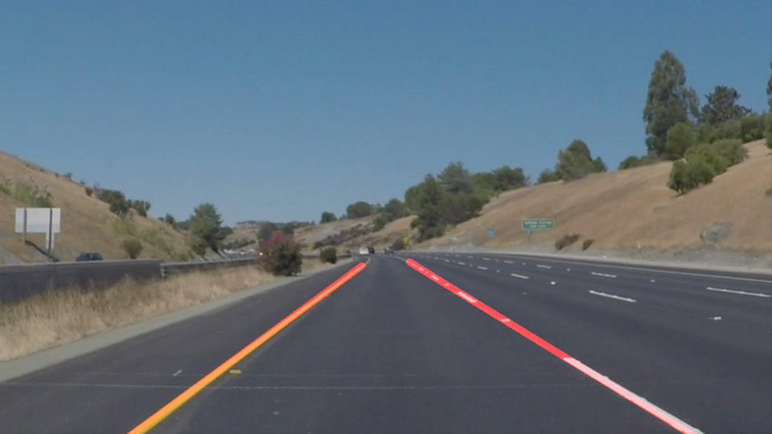
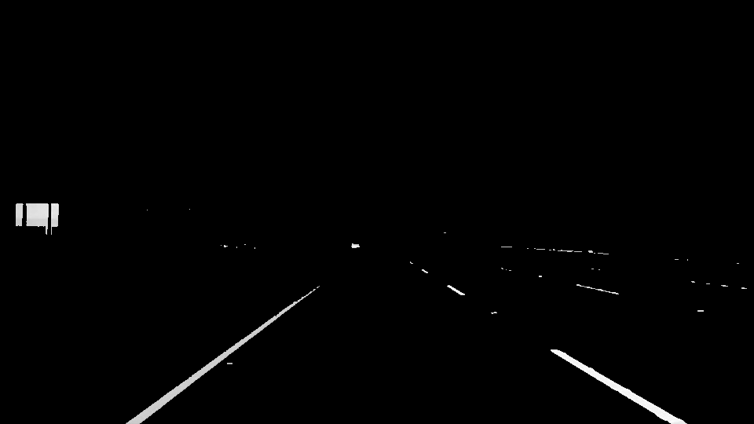
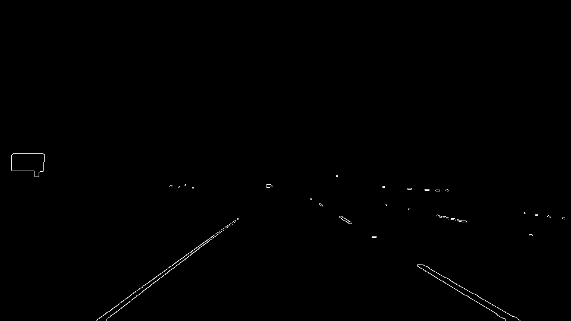
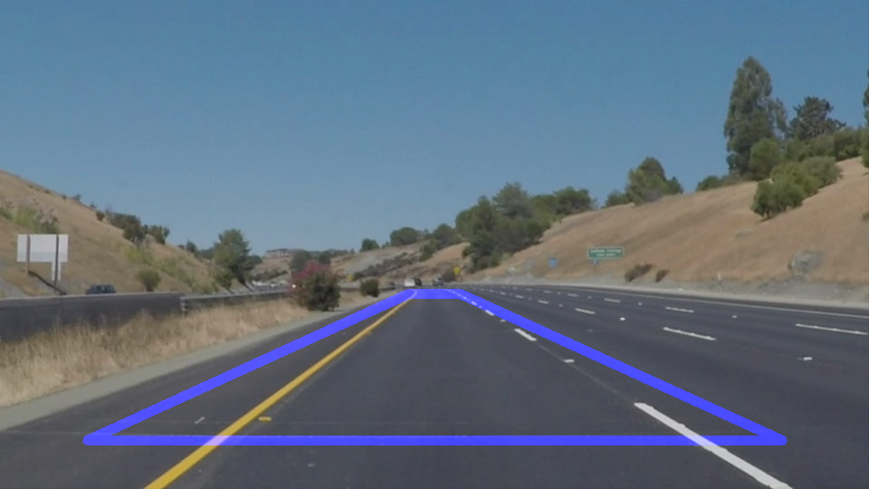
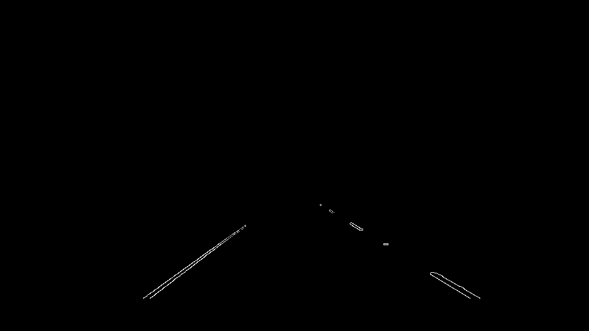
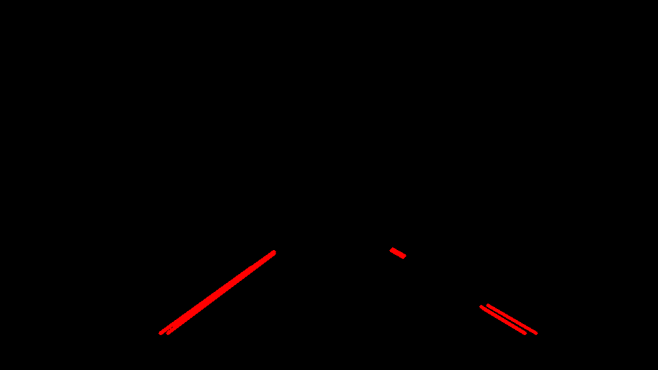

#**Finding Lane Lines on the Road** 

Overview
---

When we drive, we use our eyes to decide where to go.  The lines on the road that show us where the lanes are act as our constant reference for where to steer the vehicle.  Naturally, one of the first things we would like to do in developing a self-driving car is to automatically detect lane lines using an algorithm.

The Project
---

**Step 1:** Focus on potintial areas using color segmentation

Mainly most of lanes are white or yellow so as initial step filter these colors. 
Transforming image to HSV space and filter only yellow and white colored pixel and mask the rest of picture.
For this step we define range of possible yellow and white values in HSV space and using "inrange" function from opencv lib. to filter out the rest of colors.

**Step 2:** closing the gaps

Filter the image and connect any missy areas will inhance our edge detection algorithm. for this we used morphological "closing" operator from opencv lib. 

**Step 3:** Edge Detection  

For edge detection, canny edge operater is used. good tunning minimum and maximum thershold parameters of canny operator will inhance outputed edges.

**Step 4:** Focus on lanes` edges 

By croping only a Region of Interset where lanes of Ego car is moving in, while reduce any potintial noise data for lane lines detection

Cropped Edges 

**Step 5:** Line Segments Detection
Using Hough Transform of edges outputed from Canny operator will results in finding most suitable line segmants in image. 

**Step 6:** Connecting Lane Lines
After generating multiple line segments from Hough Transform representing all possible lines in ROI. fitting single line representing right lane and another one for left lane is needed.
This is done by following this procedure:
1- filter out horozintal lines by applying thershold on line`s slope for example (-15,15) deg.
2- diffrentiate between line segments for right and left lane using the angle of slope ( positive angle for right lane and negative for left lane)
3- using RANSAC linear Regression Algorithm to fit a straight line representing each lane

Note: RANSAC Algorthim is used instead of normal line fitting technique due its ability to choose best fit line and negelect outliers. 

Final Output of Lane Finding Pipeline
---

Potential shortcomings
---
1-this pipeline depend on detecting and segments white and yellow colors. which will fail in case of night or shadows
2- many tunnable parameters to detect lanes can be hard to optimize

Possible improvements
---
1- Enhancing this pipeline by using fusion algorithms to fuse output from multiple techniques and also track the lane information in case of non-detection scenarios
2- Using Deep Learning Algorithms to train a new pipeline work on all situations 

